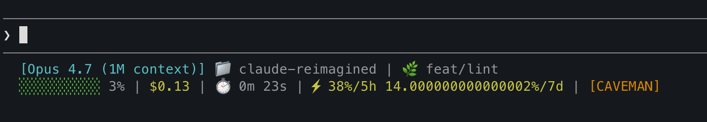

# claude-reimagined

> A one-command bootstrap that turns a fresh machine into a fully wired Claude Code workstation — CLI, plugins, hooks, MCP servers, statusline, and a 40+ skill library, all configured to work together out of the box.

If you've ever spent an afternoon stitching together [Claude Code](https://github.com/anthropics/claude-code), [RTK](https://github.com/rtk-ai/rtk), [context-mode](https://github.com/mksglu/context-mode), [code-review-graph](https://pypi.org/project/code-review-graph/), [caveman](https://github.com/JuliusBrussee/caveman), custom hooks, and a skill router — this repo is that afternoon, automated.

---

## Table of Contents

- [Install](#install)
- [Repository Structure](#repository-structure)
- [What You Get](#what-you-get)
- [code-review-graph Per-Repo Setup](#code-review-graph-per-repo-setup)
- [Hooks Deep-Dive](#hooks-deep-dive)
- [Settings](#settings)
- [Skills Library](#skills-library)
- [Where Files Land](#where-files-land)
- [Rollback](#rollback)
- [Requirements](#requirements)
- [Troubleshooting](#troubleshooting)
- [Contributing](#contributing)
- [License](#license)

---

## Install

Three steps. macOS or Linux.

```bash
git clone https://github.com/kunaltulsidasani/claude-reimagined.git
cd claude-reimagined
./bootstrap.sh
```

The bootstrapper will:

1. Detect your OS and check for missing dependencies (`curl`, `git`, `python3`, `npm`, `jq`, `pipx`).
2. Walk through each component, explain what it does, and ask before installing — **default is yes**, just hit Enter to accept. Type `n` to skip.
3. Print a verification summary at the end.

### Other modes

```bash
./bootstrap.sh --dry-run                              # preview only — no changes
./bootstrap.sh --yes                                  # auto-approve every prompt (no confirmations)
./bootstrap.sh --force                                # reinstall components already present
./bootstrap.sh --clean --yes                          # wipe ~/.claude first, then fresh install
./bootstrap.sh --skip rtk,caveman                     # skip specific components
./bootstrap.sh --skills-only python-pro,golang-pro    # install only chosen skills
```

---

## Repository Structure

```
claude-reimagined/
├── bootstrap.sh                  # entry point — orchestrates every install script
├── statusline.sh                 # Claude Code statusline renderer
├── Makefile                      # `make install`, `make test`, `make verify`
├── CLAUDE.md                     # project-level Claude Code instructions
├── LICENSE                       # MIT
│
├── configs/
│   └── settings.json             # reference settings.json (user-managed copy)
│
├── hooks/
│   ├── pre-compact.sh            # PreCompact hook — survives auto-compaction
│   └── subagent-model-router.sh  # PreToolUse[Agent] hook — routes models per subagent
│
├── lib/
│   └── common.sh                 # shared bash helpers (logging, prompts, results)
│
├── scripts/
│   ├── install_deps.sh             # curl, git, python3, npm, jq, pipx
│   ├── install_claude_code.sh      # Claude Code CLI
│   ├── install_rtk.sh              # RTK token-killer proxy
│   ├── install_context_mode.sh     # context-mode MCP plugin
│   ├── install_code_review_graph.sh# code-review-graph MCP server
│   ├── install_caveman.sh          # caveman terse-mode plugin
│   ├── install_statusline.sh       # statusline registration
│   ├── install_subagent_router.sh  # subagent model-routing hook
│   ├── install_pre_compact.sh      # pre-compact hook
│   ├── install_skills.sh           # 39 skills from registry.yaml via sparse clone
│   └── verify_installation.sh      # post-install verification
│
├── skills/
│   └── registry.yaml             # curated skill registry (id → repo:path, tier)
│
├── tests/
│   ├── run_tests.sh              # zero-dep bash test runner
│   ├── lib/helpers.sh            # test fixtures and assertions
│   ├── unit/                     # unit tests — common.sh, hooks, routers
│   └── integration/              # E2E tests for every install script
│
└── logs/                         # ignored — populated at runtime
```

---

## What You Get

Each component solves a specific pain point with vanilla Claude Code. You can skip any of them with `--skip <id>`.


| Component             | Upstream                                                               | Why you want it                                                                                                                                                                                                                                                  |
| --------------------- | ---------------------------------------------------------------------- | ---------------------------------------------------------------------------------------------------------------------------------------------------------------------------------------------------------------------------------------------------------------- |
| **claude-code**       | [anthropics/claude-code](https://github.com/anthropics/claude-code)    | The CLI everything else plugs into.                                                                                                                                                                                                                              |
| **rtk**               | [rtk-ai/rtk](https://github.com/rtk-ai/rtk)                            | Shell proxy that rewrites `git`/`ls`/`grep`/etc. through a token-aware filter. **60–90%** less context burned on shell output. A hook rewrites `git status` → `rtk git status` transparently.                                                                    |
| **code-review-graph** | [PyPI: code-review-graph](https://pypi.org/project/code-review-graph/) | Tree-sitter knowledge graph of your codebase: functions, classes, calls, imports, tests. Updates incrementally on file change. Claude queries the graph instead of re-reading files. *Per-repo setup required — see [below](#code-review-graph-per-repo-setup).* |
| **context-mode**      | [mksglu/context-mode](https://github.com/mksglu/context-mode)          | MCP plugin. Routes large command output (build logs, test runs, JSON dumps) into a sandbox FTS5 index. A `pytest -v` eats ~200 tokens instead of 50k.                                                                                                            |
| **caveman**           | [JuliusBrussee/caveman](https://github.com/JuliusBrussee/caveman)      | Plugin that injects a terse-style system prompt. ~75% fewer output tokens with no loss of correctness.                                                                                                                                                           |
| **statusline**        | (this repo)                                                            | Renders model, repo, branch, context %, cost, session time, 5h/7d burn rate, and active mode tag into your terminal statusline. *([preview](#statusline-preview))*                                                                                               |
| **subagent-router**   | (this repo)                                                            | `PreToolUse[Agent]` hook that pins Haiku for cheap lookups, Sonnet for general work, Opus only when explicitly chosen. Saves cost on every spawned agent automatically.                                                                                          |
| **pre-compact**       | (this repo)                                                            | `PreCompact` hook that detects your stack and writes preservation instructions before auto-compaction. Mid-task state, error messages, and blocked work survive every compact.                                                                                   |
| **skills**            | various — see [registry](skills/registry.yaml)                         | 39 curated domain skills installed into `~/.claude/skills/` via sparse clone.                                                                                                                                                                                    |


---

## Statusline Preview



Shows model, repo, branch, context %, cost, session time, 5h/7d burn rate, and active mode tag.

---

## code-review-graph Per-Repo Setup

The bootstrapper installs the `code-review-graph` binary globally, but the **MCP integration is per-repo** — you opt in for each project where you want it.

```bash
cd /path/to/your/repo
code-review-graph install
```

That command:

1. Adds an MCP server entry to the project's `.mcp.json` (or creates one).
2. Sets up file-watcher hooks (via Claude Code's `PostToolUse` hook system) so the graph updates incrementally on every `Edit`, `Write`, or `MultiEdit`.
3. Builds the initial graph by parsing the repo with Tree-sitter (one-time, takes seconds to a minute depending on repo size).

### Verify it worked

```bash
code-review-graph status      # shows nodes/edges/files counts
ls .code-review-graph/         # graph DB lives here, gitignored
cat .mcp.json                  # MCP server entry should be present
```

In Claude Code, the graph tools (`detect_changes`, `get_review_context`, `query_graph`, `semantic_search_nodes`, etc.) will appear in the tool list once you restart the session. See `[CLAUDE.md](CLAUDE.md)` in this repo for an example of instructing Claude to prefer graph tools over Grep.

### Update or rebuild

```bash
code-review-graph build       # incremental rebuild (called automatically by hooks)
code-review-graph build --full # full rebuild from scratch
```

### Add `.code-review-graph/` to gitignore

```
echo '.code-review-graph/' >> .gitignore
```

The graph database is local-machine state — don't commit it.

---

## Hooks Deep-Dive

### `pre-compact` — survive context compaction

- **File:** `hooks/pre-compact.sh` → `~/.claude/hooks/pre-compact.sh`
- **Fires:** immediately before Claude auto-compacts (triggered at 80% context via `CLAUDE_AUTOCOMPACT_PCT_OVERRIDE`).
- **Does:** detects your stack, schema files, API directories, and git state, then writes preservation instructions to stdout. Claude's compaction summarizer reads these and decides what to keep.

**Stack detection covers:** JS/TS (Next.js, NestJS, React, Node), Go, Python (FastAPI, Django, Flask), Rust, Flutter, Java/Maven, Kotlin/Gradle, Ruby/Rails, Swift, C#/.NET. Each stack has its own preservation rules — test command, build command, schema file, API dirs.

**The compacted summary is guaranteed to contain:** active task and next step, exact error messages, every file touched, non-obvious decisions and their reasons, pending/blocked work, discovered env constraints.

### `subagent-model-router` — auto-pick the cheapest capable model

- **File:** `hooks/subagent-model-router.sh` → `~/.claude/hooks/subagent-model-router.sh`
- **Fires:** before every `Agent` tool call.
- **Does:** inspects `subagent_type` and prompt complexity, rewrites the tool input via `updatedInput` to pin a specific model.


| Subagent type                                                    | Routed model          |
| ---------------------------------------------------------------- | --------------------- |
| `Explore`, `statusline-setup`, `claude-code-guide`               | Haiku                 |
| `general-purpose` with simple lookup prompt                      | Haiku                 |
| `general-purpose` with complex prompt (implement/debug/design/…) | Sonnet                |
| `Plan`, `superpowers:code-reviewer`                              | Sonnet (floor)        |
| everything else                                                  | inherits parent model |


---

## Settings

`~/.claude/settings.json` is **user-managed**. The bootstrapper verifies it exists at the end. A reference copy lives in `[configs/settings.json](configs/settings.json)`.


| Setting                           | Value        | Why                                                                                  |
| --------------------------------- | ------------ | ------------------------------------------------------------------------------------ |
| `CLAUDE_AUTOCOMPACT_PCT_OVERRIDE` | `80`         | Trigger auto-compact at 80% instead of 95%, giving the pre-compact hook room to run. |
| `skillListingMaxDescChars`        | `300`        | Cap skill descriptions in the listing — keeps the skill router prompt lean.          |
| `skillListingBudgetFraction`      | `0.005`      | Limit skill listing to 0.5% of context.                                              |
| `spinnerTipsEnabled`              | `false`      | Disable loading tips.                                                                |
| `effortLevel`                     | `medium`     | Default thinking effort; override per-task with `/effort`.                           |
| `promptSuggestionEnabled`         | `false`      | Disable inline suggestions.                                                          |
| `tui`                             | `fullscreen` | Full-screen TUI mode.                                                                |
| `prefersReducedMotion`            | `true`       | Disable TUI animations.                                                              |
| `showThinkingSummaries`           | `false`      | Hide extended thinking summaries.                                                    |
| `autoScrollEnabled`               | `false`      | Output stays readable mid-task.                                                      |


Hooks registered in `settings.json`:

- `PreCompact` → `pre-compact.sh`
- `PreToolUse[Agent]` → `subagent-model-router.sh`

---

## Skills Library

39 skills from community repos, sparse-cloned into `~/.claude/skills/<id>/`. Use `--skills-only <ids>` to pick a subset.

Each entry in `[skills/registry.yaml](skills/registry.yaml)` is tagged with a tier:


| Tier       | Anatomy                                 | Example                                      |
| ---------- | --------------------------------------- | -------------------------------------------- |
| **gold**   | `SKILL.md` + `scripts/` + `reference/`  | `code-reviewer`, `mcp-builder`, `claude-api` |
| **silver** | `SKILL.md` + helper scripts/refs inline | `tdd`, `debugging`                           |
| **bronze** | `SKILL.md` only (knowledge-only skill)  | most language and infra skills               |


### Gold tier (full anatomy with executable helpers)


| Skill           | Source                                                                                  |
| --------------- | --------------------------------------------------------------------------------------- |
| `mcp-builder`   | [anthropics/skills](https://github.com/anthropics/skills/tree/main/skills/mcp-builder)  |
| `claude-api`    | [anthropics/skills](https://github.com/anthropics/skills/tree/main/skills/claude-api)   |
| `code-reviewer` | [awesome-skills/code-review-skill](https://github.com/awesome-skills/code-review-skill) |


### Silver tier (helpers inline)


| Skill       | Source                                                                                           |
| ----------- | ------------------------------------------------------------------------------------------------ |
| `tdd`       | [obra/superpowers](https://github.com/obra/superpowers/tree/main/skills/test-driven-development) |
| `debugging` | [obra/superpowers](https://github.com/obra/superpowers/tree/main/skills/systematic-debugging)    |


### Bronze tier (knowledge skills)


| Category       | Skills                                                                                                                                                                  |
| -------------- | ----------------------------------------------------------------------------------------------------------------------------------------------------------------------- |
| Languages      | `python-pro`, `typescript-pro`, `golang-pro`, `rust-pro`, `java-architect`, `kotlin-specialist`, `swift-expert`, `csharp-developer`, `cpp-pro`, `php-pro`, `ruby-rails` |
| Frontend       | `react`, `vue-expert`, `angular-architect`, `nextjs-developer`                                                                                                          |
| Backend        | `nestjs-expert`, `django-expert`, `fastapi-expert`, `laravel-specialist`                                                                                                |
| Databases      | `postgres-pro`, `redis-pro`, `mongodb-pro`, `database-designer`                                                                                                         |
| Infrastructure | `aws-solution-architect`, `terraform`, `kubernetes-ops`, `docker`, `ci-cd`                                                                                              |
| Testing        | `unit-tests`                                                                                                                                                            |
| API            | `api-designer`, `openapi-docs`                                                                                                                                          |
| Engineering    | `security-review`, `git-workflow`                                                                                                                                       |


Upstream sources (full repo list):

- [anthropics/skills](https://github.com/anthropics/skills)
- [obra/superpowers](https://github.com/obra/superpowers)
- [awesome-skills/code-review-skill](https://github.com/awesome-skills/code-review-skill)
- [Jeffallan/claude-skills](https://github.com/Jeffallan/claude-skills)
- [Mindrally/skills](https://github.com/Mindrally/skills)
- [alirezarezvani/claude-skills](https://github.com/alirezarezvani/claude-skills)
- [seokheejang/claude-ops-skills](https://github.com/seokheejang/claude-ops-skills)
- [SpillwaveSolutions/document-specialist-skill](https://github.com/SpillwaveSolutions/document-specialist-skill)
- [clear-solutions/unit-tests-skills](https://github.com/clear-solutions/unit-tests-skills)

---

## Where Files Land


| Path                                       | Contents                                |
| ------------------------------------------ | --------------------------------------- |
| `~/.claude/settings.json`                  | Claude Code settings — **user-managed** |
| `~/.claude/CLAUDE.md`                      | Global instructions — **user-managed**  |
| `~/.claude/statusline.sh`                  | Statusline script                       |
| `~/.claude/hooks/subagent-model-router.sh` | Subagent model routing hook             |
| `~/.claude/hooks/pre-compact.sh`           | Pre-compact instructions hook           |
| `~/.claude/skills/<id>/`                   | Skill directories from registry         |
| `~/.claude.json`                           | MCP server registrations (context-mode) |
| `~/.claude-bootstrap/logs/results.tsv`     | Per-component install results           |
| `~/.claude-bootstrap/logs/`                | Full log output per run                 |


---

## Rollback

Every file modified by a bootstrap script is backed up first:

```
~/.claude/settings.json.bak.20240101_120000
```

Format: `<original-path>.bak.YYYYMMDD_HHMMSS`. To restore, copy the `.bak.*` file back over the original.

For a clean reinstall: `./bootstrap.sh --clean --yes` wipes `~/.claude` first.

Install results land in `~/.claude-bootstrap/logs/results.tsv` with status `OK`, `FAILED`, `SKIPPED`, or `DECLINED`.

---

## Requirements

- macOS 12+ or Linux (x86_64 or arm64)
- bash 4.0+
- Internet access for downloads

The bootstrapper installs missing deps automatically (Homebrew on macOS; apt-get/dnf/yum on Linux).

- **Hard deps:** `curl`, `git`, `python3`, `npm`
- **Soft deps:** `jq`, `pipx`, `uv` (for code-review-graph)

---

## Troubleshooting

`**[FAIL] CLAUDE.md` or `[FAIL] settings`** — these files are user-managed. Create them at `~/.claude/CLAUDE.md` and `~/.claude/settings.json`. The bootstrapper only verifies their existence; it does not install them.

`**rtk gain` fails** — you may have the wrong `rtk` binary on your PATH (name collision with `reachingforthejack/rtk` Rust Type Kit). Run `which rtk` to check, then uninstall the wrong one (`cargo uninstall rtk` or `brew uninstall rtk`).

**Component fails mid-bootstrap** — non-critical components don't abort the run. Check `~/.claude-bootstrap/logs/results.tsv` and the per-script logs in the same directory.

**Skill missing `scripts/` or `reference/` after install** — fixed in the latest install_skills.sh. Re-run with `--force --skills-only <skill-id>`.

---

## Contributing

See [CONTRIBUTING.md](CONTRIBUTING.md) for development setup, testing, and how to add new components or skills.

Quick reference:

```bash
make install     # run bootstrap.sh interactively
make test        # run the full test suite (~140 tests)
make verify      # run verify_installation.sh
```

---

## License

[MIT](LICENSE)